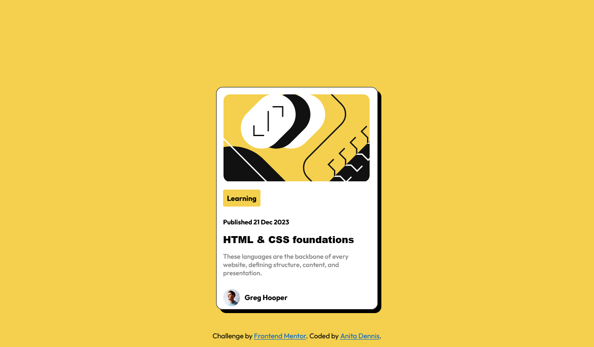

# Frontend Mentor - Blog preview card solution

This is a solution to the [Blog preview card challenge on Frontend Mentor](https://www.frontendmentor.io/challenges/blog-preview-card-ckPaj01IcS). Frontend Mentor challenges help you improve your coding skills by building realistic projects. 

## Table of contents

- [Overview](#overview)
  - [The challenge](#the-challenge)
  - [Screenshot](#screenshot)
  - [Links](#links)
- [My process](#my-process)
  - [Built with](#built-with)
  - [What I learned](#what-i-learned)
  - [Useful resources](#useful-resources)
- [Author](#author)

## Overview
A blog preview card built with html and css, had fun building it.

### The challenge

Users should be able to:

- See hover and focus states for all interactive elements on the page

### Screenshot

### Links

- [Solution URL](https://github.com/anitadenn/blog_preview_card.git)
- [Live Site URL](https://anitadenn.github.io/blog_preview_card/)

## My process
used html5 and css3, used flexbox, margin, padding, fontfamily etc

### Built with

- Semantic HTML5 markup
- CSS custom properties
- Flexbox
- svg

### What I learned

i learned how to use scalable vector graphics for the first time, and really improved on using flexbox

### Useful resources

- [Google fonts](https://www.googlefonts.com) - you can get amazing fonts from google font incase you dont like the font your website has by default 

## Author

- Github - [Anita Dennis](https://www.github.com/anitadenn)
- Frontend Mentor - [@anitadenn](https://www.frontendmentor.io/profile/anitadenn)

